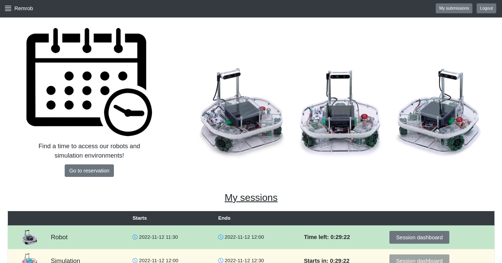
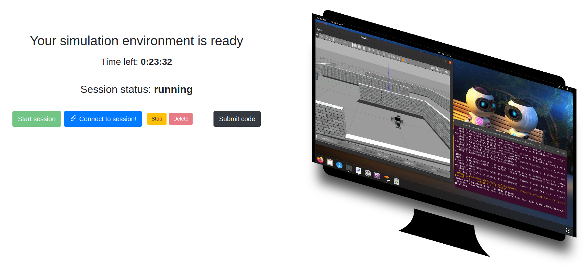
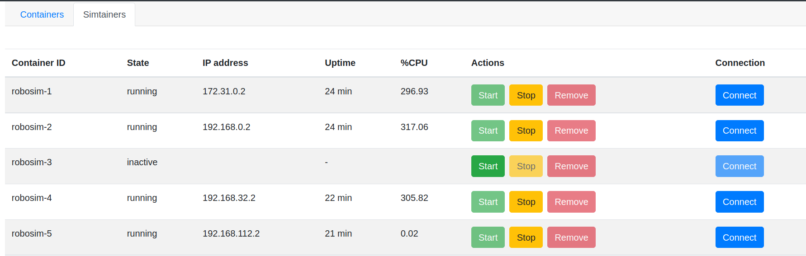
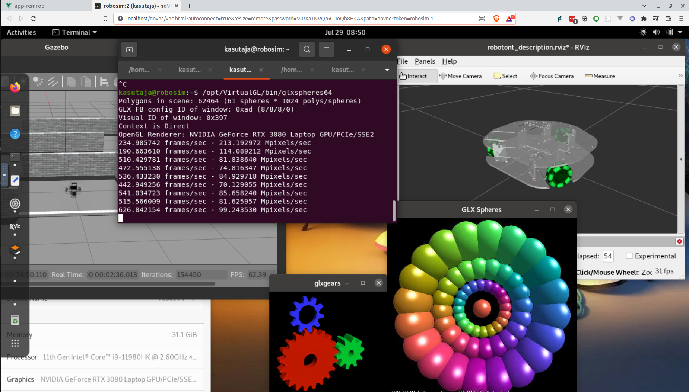

# REMROB: a web-based robotics learning and development environment

|                                         |                                              |
| --------------------------------------- | -------------------------------------------- |
|  |     |
|   |  |

## Introduction

Remrob is a web application for a remote web lab that offers an authentic ROS development experience by serving in-browser desktop workstations with the help of [noVNC](https://github.com/novnc/noVNC). Docker containers are used to encapsulate the workstations of which there are two types - simulation and physical robot enabled environments. The users are able to reserve access to the remote lab through a time slot booking module.

See ["Open Remote Web Lab for Learning Robotics and ROS With Physical and Simulated Robots in an Authentic Developer Environment"](https://ieeexplore.ieee.org/document/10480223) published in IEEE Transactions on Learning Technologies for more details.

Demo video: https://www.youtube.com/watch?v=FGVpwIwRrwc

## Remrob installation

See https://github.com/unitartu-remrob/remrob-setup for full remrob app installation instructions.

---

# remrob-server

A Node.js API for launching and monitoring [ROS-VNC containers](https://github.com/unitartu-remrob/remrob-docker).

The API has authentication and authorization middleware, and uses Docker compose to craft user-specific container environments.

## Requirements

- Node v20
- Docker & Docker compose
- websockify

## Setup

### Install node packages
```
npm install
```

### Copy and fill example env file
```
cp .env.example .env
```

### Dev server with hot updates
```
npm run dev
```

### Lint and formatting
```
npm run lint

npm run format
```

### Production server
```
npm run server
```

### Websockify client
```
npm run vnc-client
```

## Set available images

The images that are used by [remrob-webapp](https://github.com/unitartu-remrob/remrob-webapp) are listed under `RemrobDockerImages` at [config/default.json](./config/default.json).

All images that can be created with the help of [remrob-docker](remrob-docker) are listed, although only ones that have been built will be returned when calling `GET /images`.

Nvidia CudaGL images will be returned over same version of non-nvidia images (these are specified with the `overridenBy` flag).

## Running multiple service instances with pm2

Install the pm2 daemon process manager (available via npm)

    npm install pm2@latest -g

Start with pm2:

    npm run pm2:cluster

Run as a persistent background process:

    pm2 startup // follow instructions

    pm2 start ecosystem.config.cjs

Check status:

    pm2 status remrob

Restart with changes:

    pm2 reload remrob

Stream logs:

    pm2 logs

&nbsp;&nbsp;

# Acknowledgments

Completed with the support by IT Academy Programme of Education and Youth Board of Estonia.

Valminud Haridus- ja Noorteameti IT Akadeemia programmi toel.
