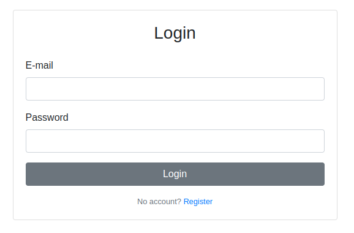

# REMROB: a web-based robotics learning and development environment

|   |   |
|---|---|
 | 
 | 

## !! Clone recursively !!
```bash
git clone --recursive https://github.com/unitartu-remrob/remrob-server
```

## Introduction

Remrob is a web application for a remote web lab that offers an authentic ROS development experience by serving in-browser desktop workstations with the help of [noVNC](https://github.com/novnc/noVNC). Docker containers are used to encapsulate the workstations of which there are two types - simulation and physical robot enabled environments. The users are able to reserve access to the remote lab through a time slot booking module.

Check out [these](https://www.youtube.com/watch?v=A3_WH9BOUK0) [demos](https://www.youtube.com/watch?v=Zb5wu1d1rSU)!

# Install with Docker

Requirements:
- Ubuntu 20.04
- [Docker Engine](https://docs.docker.com/engine/install/ubuntu/)
- [Docker Compose](https://docs.docker.com/compose/install/other/)

### Step 1:

Acquire the ros-vnc-image from [Docker Hub](https://hub.docker.com/r/unitartu/remrob-docker):

```bash
docker pull tsapu/remrob:latest
docker tag tsapu/remrob:latest remrob:base # the image name:tag is important
```

Alternatively, build it locally from [source](https://github.com/unitartu-remrob/remrob-docker) (7 GB will take some time):
```bash
git clone --recursive https://github.com/unitartu-remrob/remrob-docker
# Modify the Dockerfile to your liking (e.g. add your own ROS packages) and rebuild:
docker build -t remrob:base ./remrob-docker
```

### Step 2:

The simulation-only application can be orchestrated with docker-compose.

```bash
```bash
docker-compose up --build
```

Once the build has finished, the application can be accessed on port 8080 (e.g. http://localhost:8080)

Default user email: **admin**

Default user password: **admin**



Change the timezone and UTC offset in the compose file to run the session booking calendar in a different timezone (default is Europe/Tallinn).

For this installation only simulation environments are available for you to play with (to enable containers capable of networking with robots, proceed with the more lengthy manual installation).

&nbsp;
# Hardware acceleration

To enable hardware accelerated containers with nvidia video cards:
1. Install the [nvidia-docker-runtime](https://docs.nvidia.com/ai-enterprise/deployment-guide-vmware/0.1.0/docker.html)
2. In the docker-compose robotont template at `server/compose/templates/{local || macvlan}.j2`:

	a) VGL uses the host's display for 3D rendering, default display nr. assumed is **:0**, can be changed to a different one in the following X11 server socket mount (**X1** in the example):

	```yaml
	volumes: 
	- /tmp/.X11-unix/X1:/tmp/.X11-unix/X0:ro
	#	              ^
	```

	b) To enable GPU resources uncomment:
	```yaml
	# deploy:
	#   resources:
	#     reservations:
	#       devices:
	#         - driver: nvidia
	#           capabilities: [gpu, utility, graphics]
	```
3. Rebuild the compose templates

```bash
docker-compose build --no-cache node-container-api
```
Alternatively make the same edits within the node container and regenerate with:
```bash
docker exec -w /remrob-server/compose remrob-server_node-container-api python3 compose_generator.py
```
&nbsp;

# Manual installation 

## Requirements

This software is known to work with the following:

- Ubuntu 20.04
- [Docker Engine 20.10](https://docs.docker.com/engine/install/ubuntu/)
- [docker-compose v2.12.2](https://docs.docker.com/compose/install/other/)
- nginx v1.18.0
- PostgreSQL 12.12
- Nodejs v16.13.0
- NPM v8.19.2
- Python 3.8
- pip 20.0.2

Additional requirements:

- [websockify](https://github.com/novnc/websockify) (available via apt: `sudo apt install websockify`)
- Jinja2 template engine | `pip install Jinja2`
- [nvidia-docker-runtime](https://docs.nvidia.com/ai-enterprise/deployment-guide-vmware/0.1.0/docker.html) (follow the deployment guide)

### 1) Acquire the VNC/ROS docker image
```bash
docker pull tsapu/remrob:latest
docker tag tsapu/remrob:latest remrob:base # the image name:tag is important
```
or, build from source:
```bash
bash build-image.sh
```

### 2) Build and run the booking backend
```bash
# Build frontend
cd remrob-webapp
# In the .env example edit SQLALCHEMY_DATABASE_URI environment variable to suit your host
# (e.g. localhost)
# Also set VUE_APP_UTC_OFFSET to whatever timezone you want the booking calendar to be based on
cp .env.production.example .env.production
npm install && npm run build

# Install py modules
pip install -r requirements.txt

# Initialise the database
python3 -m flask db init
python3 -m flask db migrate
python3 -m flask db upgrade

# Run the flask backend
npm start
```
### 3) Build and run the container API
```bash
cd server && npm install
# In the .env example modify DB_SERVER and DB_URL to have your host (e.g. localhost)
cp .env.example .env
# Change the server timezone to yours at config/default.json
npm run prod # this will start both websockify and node servers
```
### 4) Generate compose templates for starting ROS-VNC containers

Change network config at `server/compose/config` & `server/websockify-token.cfg` to suit the IP range of your robots.
```bash
cd remrob-server/server/compose
python3 compose-generator.py
```
### 5) Set up nginx
```bash
# !NB: modify the proxied endpoints in the nginx.conf file to suit your host
# Copy configuration and restart
sudo cp remrob-server/nginx.conf /etc/nginx/sites-enabled/default
sudo systemctl restart nginx
```

Access via port 80 (e.g. http://127.0.0.1)

&nbsp;

# Network specification for enabling containers to connect to physical robots

To allow full communication between the containers and the robotonts *macvlan* docker network type can be used. It requires an ethernet interface with promiscuous mode enabled (does not work with a wireless interface). The following steps are based on [this article](https://blog.oddbit.com/post/2018-03-12-using-docker-macvlan-networks/).


### Create the macvlan docker network
1. Toggle promiscuous mode

	`sudo ifconfig {eth_iface} promisc`

2. Create the docker network

	`docker network create -d macvlan -o parent={eth_iface} --gateway={router gateway} --subnet={router subnet} --ip-range={available range of ip's on the router} remrob`

	**Example:**
	`docker network create -d macvlan -o parent=enp46s0 --gateway=192.168.0.1 --subnet=192.168.0.0/24 --ip-range=192.168.0.192/27 remrob`

### Make the containers available to host
1. Make a custom macvlan interface

	`ip link add {if_name} link {your_eth_if} type macvlan mode bridge`

	**Example:**
	`ip link add my_nic link enp46s0 type macvlan mode bridge`

2. Give it an IP address

	`ip addr add {ip_addr} dev {if_name}`

	**Example:**
	`ip addr add 192.168.0.224/32 dev my_nic`

3. Enable it

	`ip link set {if_name} up`

4. Route all the containers through it

	`ip route add {docker_macvlan_ip_range} dev {if_name}`

	**Example:**
	`ip route add 192.168.0.192/27 dev my_nic`

---

### Limitations & issues:

- After starting the container it initially takes some time before application windows get drawn.
- For high container load (10+) the default inotify user instances and watch limits must be increased (see [this](https://bugzilla.proxmox.com/show_bug.cgi?id=1042))
- The containers are run with --cap-add=SYS_ADMIN in order to enable systemd, which is needed for gnome.
- Does not work with newer versions of Ubuntu (e.g. 22.04) because of a newer, incompatible systemd (see [this](https://github.com/geerlingguy/docker-ubuntu2004-ansible/issues/18))


&nbsp;

&nbsp;

# Acknowledgments

Completed with the support by IT Academy Programme of Education and Youth Board of Estonia.

Valminud Haridus- ja Noorteameti IT Akadeemia programmi toel.