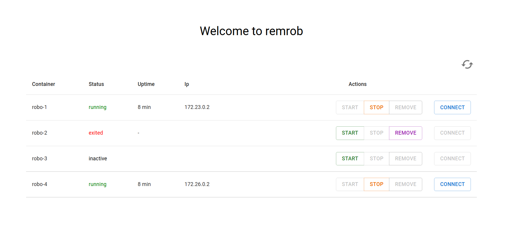
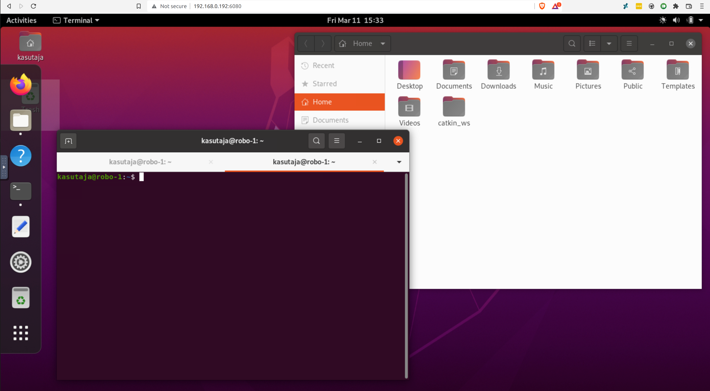

Clone recursively, project uses [existing robotont software](https://github.com/robotont) and the [noVNC](https://github.com/novnc/noVNC) client as submodules

`git clone --recursive https://github.com/Tsapu/rem-rob`

# Requirements

- Docker & docker-compose(1.28.0+)
- [nvidia-docker-runtime](https://docs.docker.com/config/containers/resource_constraints/#gpu) (comes with nvidia-docker2)
- nginx
- Nodejs & npm
- [websockify](https://github.com/novnc/websockify)

# Network specification

To allow full communication between the containers and the robotonts *macvlan* docker network type can be used. It requires an ethernet interface with promiscuous mode enabled (does not work with a wireless interface).

### Create the macvlan docker network
1. Toggle promiscuous mode

`sudo ifconfig {eth_iface} promisc`

2. Create the docker network

`docker network create -d macvlan -o parent={eth_iface} --gateway={router gateway} --subnet={router subnet} --ip-range={available range of ip's on the router} {network_name}`

**Example:**
`docker network create -d macvlan -o parent=enp46s0 --gateway=192.168.0.1 --subnet=192.168.0.0/24 --ip-range=192.168.0.192/27 pub_net`

### Make the containers available to host
1. Make a custom macvlan interface

`ip link add {if_name} link {your_eth_if} type macvlan mode bridge`

**Example:**
`ip link add my_nic link enp46s0 type macvlan mode bridge`

2. Give it an IP address

`ip addr add {ip_addr} dev {if_name}`

**Example:**
`ip addr add 192.168.0.224/32 dev my_nic`

3. Enable it

`ip link set {if_name} up`

4. Route all the containers through it

`ip route add {docker_macvlan_ip_range} dev {if_name}`

**Example:**
`ip route add 192.168.0.192/27 dev my_nic`

Based on [this article](https://blog.oddbit.com/post/2018-03-12-using-docker-macvlan-networks/)

# Setup steps

### Building the image

A vnc-ros-gnome image (inspired by and built upon from this [image](https://github.com/darkdragon-001/Dockerfile-Ubuntu-Gnome))

`cd images && docker build -t robotont:base .`

Can manually start a specific robotont mirror with docker-compose:

`cd images/robo-{x} && docker-compose up`

### Running the vnc client and the server that acts as the connector

1. Copy the nginx configuration to your system

2. Build frontend

`cd server/client && npm run build`

3. Install main server modules, start the websockify proxy and the main server

`cd server && npm install`

`npm run vnc-client && npm run server`

## Customizing the gnome GUI

Copy your custom binary (found at `~/.config/dconf/user`) into `images` and rebuild

---

### To do:

- Make a server that can handle multiple websocket proxies at once ✅
- Make the image more user-friendly ✅
- Enable NVIDIA hardware acceleration in the containers ✅
- Run the containers as a non-root user ✅
- Pipe everything through a single VNC client (instead of having separate one for each container) ✅
- Dynamic passwords ✅
- Basic container control API ✅
- Hook up a database to test user systems and save committed container states

### Limitations & issues:

- If port mapping is used, then after starting the container it takes about half a minute before it loads the graphical gnome config for the user. With macvlan no such delay encountere
- For some reason after the 9th container the vnc servers running in new containers become unresponsive (10+) 
- Cannot edit files that require sudo privileges with GUI applications (e.g. `sudo gedit /etc/hosts`), must use a CLI editor (e.g. nano)
- SYS_ADMIN container privileges currently required to run systemd, which is needed for gnome

---

A very configurable docker-vnc setup providing options between lxde, lxqt and xfce4 environments (no gnome) can be found [here](https://github.com/fcwu/docker-ubuntu-vnc-desktop).

